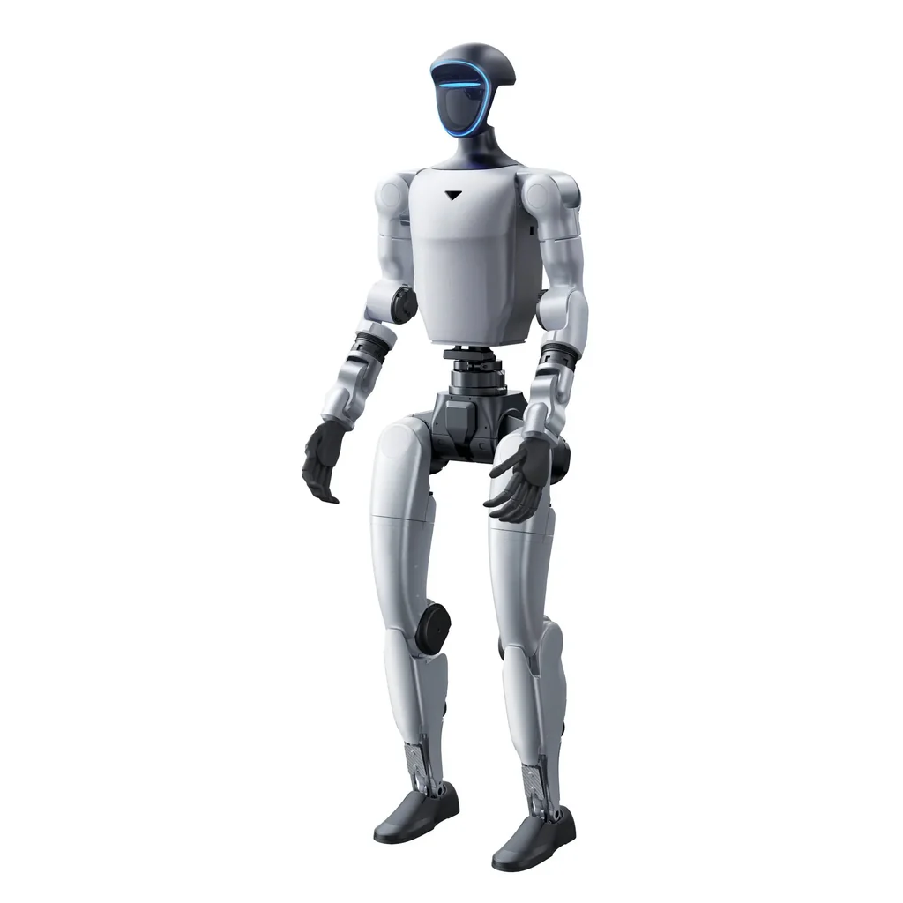

# G1 Humanoid Locomotion — State-Estimation-Aware Reinforcement Learning (WIP)

<div align="center">


**Training-time injection of sensor-derived state estimation for sim-to-real legged locomotion**

[](https://isaac-sim.github.io/IsaacLab/)
[](https://www.python.org/)

</div>

---

## Origins: The Privileged Observation Gap

Before closing the sim-to-real loop on the Unitree G1 humanoid, this project began as a principled interrogation of a structural assumption pervasive in legged locomotion reinforcement learning: the reliance on **privileged base velocity**, a ground-truth kinematic signal computed directly by the physics engine and exposed to the policy as an observation. No embodied system possesses this oracle. Physical platforms must reconstruct linear velocity from noisy inertial measurements, intermittent leg-odometry zero-velocity updates, and kinematic constraints subject to model uncertainty and contact sensing errors.

This stage established the project's theoretical foundation: demonstrating that a linear per-axis Kalman filter fusing IMU integration with leg-odometry Jacobian constraints could achieve sufficient estimation accuracy (0.26 m/s MAE against ground truth) to serve as a viable training signal, and empirically proving that a proximal-policy-optimization policy could converge to a dynamically stable, timeout-surviving gait without ever observing privileged velocity during training.

---

## Overview

**G1 Humanoid Locomotion** is a custom **work-in-progress** manager-based reinforcement learning task extension for [Isaac Lab](https://isaac-sim.github.io/IsaacLab/) that systematically replaces the simulator's privileged base velocity observation with a **Kalman-filtered estimate** reconstructed from on-board proprioceptive and inertial sensors. Built atop Isaac Lab's velocity-tracking locomotion pipeline, the environment enables large-scale parallel training of terrain-adaptive humanoid gaits while closing the sim-to-real observation gap at the training stage — ensuring the policy never learns a dependency on information unavailable to physical hardware.

The state estimator fuses world-frame accelerometer integration (gravity-compensated, rotated via base quaternion) with leg-odometry zero-velocity updates computed from stance-foot Jacobian constraints and joint velocity measurements. During aerial phases — identified via contact-force thresholding on `net_forces_w` — the correction step is suspended and the prediction carries forward uncorrected, preserving observability structure consistent with physical contact sensing.

---

## State Estimation Architecture


### Sensor Fusion Pipeline

The `g1_observations.estimated_base_lin_vel` observation term is constructed through a three-stage estimation pipeline:

- **Prediction Step** — The accelerometer measurement `imu.data.lin_acc_b` is rotated into the world frame via the base orientation quaternion `quat_w`, gravity-compensated, and integrated forward in time: `v_k+1 = v_k + (R(q_k) · a_body,k + g) · dt`.
- **Correction Step** — For each end-effector satisfying the stance condition (`net_forces_w` exceeding a force threshold), the base velocity implied by a zero-velocity foot constraint is computed from the leg Jacobian and joint velocities, then averaged across all active stance feet to produce a measurement residual.
- **Fusion Step** — A per-axis Kalman filter with diagonal process and measurement covariance matrices fuses prediction and correction. During flight phases (no foot satisfying the contact threshold), the update is skipped and the prediction propagates open-loop, mirroring the observability degradation physical systems experience in aerial phases.

---

## Environments

Four Gym-registered tasks provide a complete training-to-evaluation lifecycle for flat and rough terrain locomotion:

| Task ID | Config Class | Description |
|---|---|---|
| `Isaac-Velocity-Flat-G1-v0` | `G1FlatEnvCfg` | Velocity-tracking locomotion on flat terrain with state-estimation-aware observations. Trains robust forward locomotion using the Kalman-filtered velocity signal under randomized friction, mass perturbations, and external disturbances across thousands of parallel environments. |
| `Isaac-Velocity-Flat-G1-Play-v0` | `G1FlatEnvCfg_PLAY` | Flat-terrain evaluation variant with all domain randomization disabled. Intended for policy validation, quantitative benchmarking, and controlled gait analysis. Deterministic behavior ensures reproducible trajectory and metric comparison. |
| `Isaac-Velocity-Rough-G1-v0` | `G1RoughEnvCfg` | Velocity-tracking locomotion on procedurally generated rough terrain with Perlin height-field noise, slope variation, and obstacle gaps. Evaluates estimator drift under inconsistent contact schedules and tests gait robustness to terrain-induced perturbations. |
| `Isaac-Velocity-Rough-G1-Play-v0` | `G1RoughEnvCfg_PLAY` | Rough-terrain evaluation with fixed terrain seeds and zero randomization. Validates generalization to unseen rough terrain geometries and provides consistent conditions for measuring velocity-tracking error and estimator convergence. |

<div align="center">

[Flat Terrain OG Gait](docs/videos/Limping.gif)*Flat terrain gait *Rough terrain gait *

</div>

---

## System Architecture

```
g1_locomotion/
├── __init__.py                  # Gym environment registration (4 tasks)
├── g1_velocity_env_cfg.py       # Base LocomotionVelocityRoughEnvCfg
│                                 #   → scene composition, reward terms, event randomization, terrain generation
├── g1_observations.py           # Observation terms
│                                 #   → estimated_base_lin_vel (Kalman-filtered IMU + leg odometry)
├── g1_rewards.py                # Reward terms (~12 gait-shaping objectives)
│                                 #   → symmetry regularization, swing/stance phase penalties, torso uprightness, anti-hop constraints
├── flat_env_cfg.py              # Flat-terrain training and play configurations
├── rough_env_cfg.py             # Rough-terrain training and play configurations
└── agents/
    └── rsl_rl_ppo_cfg.py        # RSL-RL PPO runner configuration
```

---

## Quick Start

### Prerequisites

- [Isaac Sim](https://developer.nvidia.com/isaac-sim) ≥ 4.0
- [Isaac Lab](https://isaac-sim.github.io/IsaacLab/) ≥ 1.0
- Python 3.10+

### Installation

The reinforcement learning training pipeline, reward-shaping strategy, and environment configuration extend the existing humanoid locomotion framework in Isaac Lab. The Isaac Lab humanoid reference provides the foundational velocity-tracking locomotion architecture, domain-randomization methodology, and curriculum design that this project builds upon — systematically adapted for state-estimation-aware training on the Unitree G1 humanoid platform.

```bash
pip install -e source/g1_locomotion
```

> **⚠️ Asset Path:** Ensure the Unitree G1 USD asset is available in your Isaac Sim asset library prior to environment instantiation.

### Training

**Flat terrain (RSL-RL):**
```bash
./isaaclab.sh -p scripts/reinforcement_learning/rsl_rl/train.py --task Isaac-Velocity-Flat-G1-v0 --headless
```

**Rough terrain (RSL-RL):**
```bash
./isaaclab.sh -p scripts/reinforcement_learning/rsl_rl/train.py --task Isaac-Velocity-Rough-G1-v0 --headless
```

---

## Current Results

<div align="center">

[Flat Terrain Gait](docs/videos/ImprovedGait.gif)*Current flat terrain gait synthesized from Kalman-filtered velocity estimates — no privileged velocity observed during training**Current rough terrain gait under terrain perturbation, the robot learned to hop (retrain required)*

</div>

---

## Roadmap

Phase 0 and Phase 1 are complete. Subsequent phases are ordered such that each produces an independently meaningful research artifact, not merely a prerequisite for the next.

### ✅ Phase 0 — Estimator Implementation & Offline Validation
A linear per-axis Kalman filter fusing IMU integration with leg-odometry Jacobian constraints was implemented as a drop-in replacement for privileged `base_lin_vel`. Jacobian and API shape-mismatch fragility across IsaacLab versions (floating-base DOF offsets, per-body contact indexing) were resolved. The estimator achieved **0.26 m/s mean absolute error** against ground-truth base velocity in offline validation.

### ✅ Phase 1 — End-to-End RL Convergence on Estimated State
A PPO policy was trained end-to-end against the Kalman-filtered estimate — never observing privileged velocity — achieving reward convergence from **-8.6 to 23.3** over 820 of 1500 iterations with a **99.3% episode-timeout rate**, confirming the estimator is viable as a training-time observation signal, not merely accurate in isolated offline evaluation.

### 🔄 Phase 2 — Mechanistic Gait Pathology Diagnosis (In Progress)
Gait quality is being improved through systematic reward-term mechanistic analysis rather than blind hyperparameter tuning. Resolved pathologies to date include asymmetric leading-leg shuffle (addressed via gait and joint-symmetry rewards), half-swing on single leg (hip-pitch opposition + velocity-scaled gait reference), and single-leg hopping on rough terrain (traced to `feet_air_time` literally rewarding flight phase; disabled and replaced with explicit flight-phase and base-height penalties).

### ⬜ Phase 3 — Controlled Ablation & Statistical Rigor
Multi-seed training runs (n ≥ 3) for statistical confidence; controlled ablation comparing privileged velocity, current Kalman filter, and Phase 4 error-state EKF on tracking error, gait symmetry, and episode survival; formal gait-quality metrics (stance/swing duty factor, left-right symmetry index, foot-clearance distribution) beyond scalar reward.

### ⬜ Phase 4 — Error-State Extended Kalman Filter Upgrade
Extend the estimator state from velocity-only to the error-state vector `[δv, δθ, b_a, b_g]`, treating the leg-odometry residual as a genuinely nonlinear measurement function of attitude error and sensor bias. Route the same observation corruption (IMU bias drift, contact-flip probability) used for policy observations into the estimator's own prediction and update steps, closing the current train-time inconsistency where the filter never experiences the noise the policy is trained to tolerate.

### ⬜ Phase 5 — Sim-to-Sim Testing

---

## ⚠️ Disclaimer

This repository is intended for simulation-based robotics research. Trained policies and control code may produce unexpected or dynamically unstable behavior when transferred to physical hardware. Use at your own risk — validate thoroughly in simulation first, and exercise appropriate safety measures (emergency stop, physical clearance, supervised operation, protective equipment) before any physical deployment. The author(s) assume no liability for damage, injury, or loss resulting from use of this code or any hardware built to match it.

---

## References

NVIDIA, "Isaac Sim," NVIDIA Developer, 2024. Accessed: Aug. 7, 2026. [Online]. Available: https://developer.nvidia.com/isaac-sim

NVIDIA, "Isaac Lab," NVIDIA Developer, 2024. Accessed: Aug. 7, 2026. [Online]. Available: https://developer.nvidia.com/isaac/lab

C. Schwarke et al., "RSL-RL: A Learning Library for Robotics Research," arXiv preprint arXiv:2509.10771, Sep. 2025. Accessed: Aug. 7, 2026. [Online]. Available: https://github.com/leggedrobotics/rsl_rl

Unitree, "G1 Humanoid Robot," Unitree Robotics, 2024. Accessed: Aug. 7, 2026. [Online]. Available: https://www.unitree.com/products/g1](https://www.unitree.com/g1)

NVIDIA, "Isaac Lab — Locomotion Velocity Tracking," Isaac Lab Documentation. Accessed: Aug. 7, 2026. [Online]. Available: https://isaac-sim.github.io/IsaacLab/
