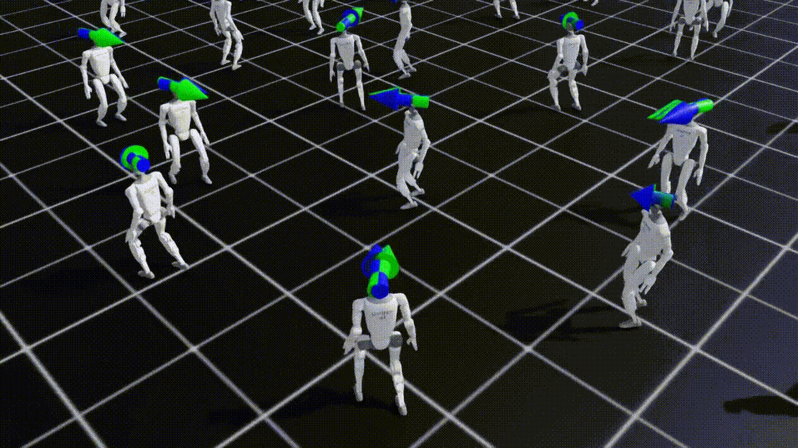

# G1 Humanoid Locomotion — State-Estimation-Aware Reinforcement Learning (WIP)

<div align="center">


**Training-time injection of sensor-derived state estimation for sim-to-real legged locomotion (https://www.robotshop.com/cdn/shop/files/pp_4519946.webp?v=1785511318&width=1024)**

[](https://isaac-sim.github.io/IsaacLab/)
[](https://www.python.org/)

</div>

---

## Abstract

This work presents a state-estimation-aware reinforcement learning framework for sim-to-real legged locomotion on the Unitree G1 humanoid, addressing a structural gap in standard legged-RL pipelines: reliance on privileged base velocity, a ground-truth signal available only in simulation. The proposed approach replaces this privileged observation with a Kalman-filtered velocity estimate reconstructed from on-board proprioceptive and inertial sensing, fusing world-frame accelerometer integration with leg-odometry zero-velocity updates derived from stance-foot Jacobian constraints. During aerial phases, identified via contact-force thresholding, the correction step is suspended and the estimate propagates open-loop, preserving the observability structure of physical contact sensing. An initial linear per-axis Kalman filter achieved 0.26 m/s mean absolute error against ground truth and supported convergence of a proximal-policy-optimization policy to a stable, timeout-surviving gait without ever observing privileged velocity during training. The framework is built as a manager-based Isaac Lab task extension spanning four Gym-registered environments for flat- and rough-terrain velocity tracking, with domain randomization over friction, mass, and external perturbations, and biomechanical reward shaping for swing-phase and contact-balance behavior. Current work extends the estimator to a body-frame Extended Kalman Filter under corrupted IMU inputs and sticky Markov-chain contact noise for rough-terrain generalization, with planned cross-simulator validation (PyBullet, MuJoCo) and exteroceptive perception-driven locomotion as subsequent research phases. This estimator-in-the-loop training methodology aims to close the sim-to-real observation gap at the training stage, ensuring learned policies never depend on information unavailable to physical hardware.

---

## Origins: The Privileged Observation Gap

Before closing the sim-to-real loop on the Unitree G1 humanoid, this project began as a principled interrogation of a structural assumption pervasive in legged locomotion reinforcement learning: the reliance on **privileged base velocity**, a ground-truth kinematic signal computed directly by the physics engine and exposed to the policy as an observation. No embodied system possesses this oracle. Physical platforms must reconstruct linear velocity from noisy inertial measurements, intermittent leg-odometry zero-velocity updates, and kinematic constraints subject to model uncertainty and contact sensing errors.

This stage established the project's theoretical foundation: demonstrating that a linear per-axis Kalman filter fusing IMU integration with leg-odometry Jacobian constraints could achieve sufficient estimation accuracy (0.26 m/s MAE against ground truth) to serve as a viable training signal, and empirically proving that a proximal-policy-optimization policy could converge to a dynamically stable, timeout-surviving gait without ever observing privileged velocity during training.

---

## Overview

**G1 Humanoid Locomotion** is a custom **work-in-progress** manager-based reinforcement learning task extension for [Isaac Lab](https://isaac-sim.github.io/IsaacLab/) that systematically replaces the simulator's privileged base velocity observation with a **Kalman-filtered estimate** reconstructed from on-board proprioceptive and inertial sensors. Built atop Isaac Lab's velocity-tracking locomotion pipeline, the environment enables large-scale parallel training of terrain-adaptive humanoid gaits while closing the sim-to-real observation gap at the training stage — ensuring the policy never learns a dependency on information unavailable to physical hardware.

The state estimator fuses world-frame accelerometer integration (gravity-compensated, rotated via base quaternion) with leg-odometry zero-velocity updates computed from stance-foot Jacobian constraints and joint velocity measurements. During aerial phases — identified via contact-force thresholding on `net_forces_w` — the correction step is suspended and the prediction carries forward uncorrected, preserving observability structure consistent with physical contact sensing.

---

## State Estimation Architecture


### Sensor Fusion Pipeline

The `g1_observations.estimated_base_lin_vel` observation term is constructed through a three-stage estimation pipeline:

- **Prediction Step** — The accelerometer measurement `imu.data.lin_acc_b` is rotated into the world frame via the base orientation quaternion `quat_w`, gravity-compensated, and integrated forward in time: `v_k+1 = v_k + (R(q_k) · a_body,k + g) · dt`.
- **Correction Step** — For each end-effector satisfying the stance condition (`net_forces_w` exceeding a force threshold), the base velocity implied by a zero-velocity foot constraint is computed from the leg Jacobian and joint velocities, then averaged across all active stance feet to produce a measurement residual.
- **Fusion Step** — A per-axis Kalman filter with diagonal process and measurement covariance matrices fuses prediction and correction. During flight phases (no foot satisfying the contact threshold), the update is skipped and the prediction propagates open-loop, mirroring the observability degradation physical systems experience in aerial phases.

---

## Environments

Four Gym-registered tasks provide a complete training-to-evaluation lifecycle for flat and rough terrain locomotion:

| Task ID | Config Class | Description |
|---|---|---|
| `Isaac-Velocity-Flat-G1-v0` | `G1FlatEnvCfg` | Velocity-tracking locomotion on flat terrain with state-estimation-aware observations. Trains robust forward locomotion using the Kalman-filtered velocity signal under randomized friction, mass perturbations, and external disturbances across thousands of parallel environments. |
| `Isaac-Velocity-Flat-G1-Play-v0` | `G1FlatEnvCfg_PLAY` | Flat-terrain evaluation variant with all domain randomization disabled. Intended for policy validation, quantitative benchmarking, and controlled gait analysis. Deterministic behavior ensures reproducible trajectory and metric comparison. |
| `Isaac-Velocity-Rough-G1-v0` | `G1RoughEnvCfg` | Velocity-tracking locomotion on procedurally generated rough terrain with Perlin height-field noise, slope variation, and obstacle gaps. Evaluates estimator drift under inconsistent contact schedules and tests gait robustness to terrain-induced perturbations. |
| `Isaac-Velocity-Rough-G1-Play-v0` | `G1RoughEnvCfg_PLAY` | Rough-terrain evaluation with fixed terrain seeds and zero randomization. Validates generalization to unseen rough terrain geometries and provides consistent conditions for measuring velocity-tracking error and estimator convergence. |

<div align="center">

**Flat terrain gait** **Rough terrain gait**

</div>

---

## System Architecture

```
g1_locomotion/
├── __init__.py                  # Gym environment registration (4 tasks)
├── g1_velocity_env_cfg.py       # Base LocomotionVelocityRoughEnvCfg
│                                 #   → scene composition, reward terms, event randomization, terrain generation
├── g1_observations.py           # Observation terms
│                                 #   → estimated_base_lin_vel (Kalman-filtered IMU + leg odometry)
├── g1_rewards.py                # Reward terms (~12 gait-shaping objectives)
│                                 #   → symmetry regularization, swing/stance phase penalties, torso uprightness, anti-hop constraints
├── flat_env_cfg.py              # Flat-terrain training and play configurations
├── rough_env_cfg.py             # Rough-terrain training and play configurations
└── agents/
    └── rsl_rl_ppo_cfg.py        # RSL-RL PPO runner configuration
```

---

## Quick Start

### Prerequisites

- [Isaac Sim](https://developer.nvidia.com/isaac-sim) ≥ 4.0
- [Isaac Lab](https://isaac-sim.github.io/IsaacLab/) ≥ 1.0
- Python 3.10+

### Installation

The reinforcement learning training pipeline, reward-shaping strategy, and environment configuration extend the existing humanoid locomotion framework in Isaac Lab. The Isaac Lab humanoid reference provides the foundational velocity-tracking locomotion architecture, domain-randomization methodology, and curriculum design that this project builds upon — systematically adapted for state-estimation-aware training on the Unitree G1 humanoid platform.

```bash
pip install -e source/g1_locomotion
```

> **⚠️ Asset Path:** Ensure the Unitree G1 USD asset is available in your Isaac Sim asset library prior to environment instantiation.

### Training

**Flat terrain (RSL-RL):**
```bash
./isaaclab.sh -p scripts/reinforcement_learning/rsl_rl/train.py --task Isaac-Velocity-Flat-G1-v0 --headless
```

**Rough terrain (RSL-RL):**
```bash
./isaaclab.sh -p scripts/reinforcement_learning/rsl_rl/train.py --task Isaac-Velocity-Rough-G1-v0 --headless
```

---

## Current Results

<div align="center">

*Current flat terrain gait synthesized from Kalman-filtered velocity estimates — no privileged velocity observed during training**Current rough terrain gait under terrain perturbation, the robot learned to hop (retrain required)*

</div>

---

## Development Roadmap

The Rex project follows a structured, five-phase research pipeline that progresses from simulation foundation to cross-simulator validation. Each phase is gated by empirical validation milestones.

### Phase Overview

| Phase | Objective | Status | Key Deliverables |
|:---|:---|:---:|:---|
| **I** | Foundation & Asset Integration | ✅ Complete | High-fidelity USD articulation; 6-task Gymnasium registration |
| **II** | Flat-Terrain Locomotion | ✅ Complete | Velocity-tracking PPO policy; full domain randomization (friction, mass, CoM) |
| **III** | Rough-Terrain Generalization | 🔄 **Current** | Procedural height-field terrain; contact-state estimation; robust zero-velocity gait policies |
| **IV** | Cross-Simulator Transfer & Validation | ⏳ Planned | Multi-physics policy export; sim-to-sim gap quantification; simulator-agnostic domain randomization |
| **V** | Autonomous Behaviors in Simulation | ⏳ Future | Exteroceptive terrain perception; multi-gait latent spaces; long-horizon navigation in high-fidelity sim |

---

### Current Progress (Phase III — Rough-Terrain Generalization)

**Completed Milestones**
- **Terrain Procedural Generation:** Integrated Isaac Lab `TerrainGenerator` with Perlin noise height fields, slope variation, and obstacle gaps. Curriculum-based difficulty scaling is active.
- **State Estimation Architecture:** Implemented a body-frame Extended Kalman Filter (EKF) fusing corrupted IMU measurements with leg-odometry velocity corrections. The estimator operates entirely in the body frame to maintain yaw-invariance during locomotion.
- **Observation Corruption Pipeline:** Deployed per-step sensor caches with random-walk accelerometer bias, sticky Markov-chain contact noise, and uniform gyroscope perturbation to enforce estimator-policy consistency.
- **Biomechanical Reward Shaping:** Replaced monotonic knee-flexion rewards with Gaussian-targeted swing-phase incentives; gated contact-balance penalties to true double-support phases to avoid punishing normal single-support walking.

**Active Workstreams**
- **Attitude Estimator Robustness:** Evaluating complementary-filter drift under aggressive rough-terrain perturbations. Roll/pitch observability from gravity projection is validated; yaw-invariant body-frame velocity integration is the current focus.
- **Gait Reference Curriculum:** Cosine-decay curriculum for open-loop gait-reference rewards to prevent policy over-reliance on shaping terms. Monitoring for curriculum-cliff collapse at the 2/3 training mark.
- **Contact-State Validation:** Finite-difference verification of body-frame Jacobian foot velocities against numerical differentiation to ensure leg-odometry accuracy.

**Empirical Metrics (Current Best)**
| Metric | Value | Notes |
|:---|:---|:---|
| EKF Velocity Error (body frame) | ~1.2 m/s mean | Under investigation; Jacobian indexing and Coriolis terms being validated |
| Episode Termination (base contact) | 100% | Policy instability attributed to estimator drift; GT-quat ablation in progress |
| Mean Episode Length | ~80 steps | Early-fall regime; expected to exceed 400 steps upon estimator convergence |

---

### Future Work

**Phase IV — Cross-Simulator Transfer & Validation (Q4 2026)**

The objective of this phase is to establish simulator-agnostic policy robustness through systematic cross-physics validation, without reliance on physical hardware.

- **Multi-Physics Policy Export:** Convert converged Isaac Lab policies to ONNX for framework-agnostic inference. Validate deterministic action equivalence across PyTorch, ONNX Runtime, and TensorRT execution providers.
- **Cross-Simulator Benchmarking:** Deploy identical policy checkpoints in PyBullet and MuJoCo using URDF representations matched to the Isaac Lab articulation. Quantify performance degradation across contact solvers (TGS vs. LCP), timestep resolutions, and friction models.
- **Sim-to-Sim Gap Analysis:** Identify physics-engine-specific failure modes (e.g., foot-scuffing in rigid-contact simulators vs. soft-contact penetration in Isaac Lab). Use these discrepancies to guide targeted domain randomization—effectively treating simulator identity as an unobserved domain variable.
- **Simulator-Agnostic Domain Randomization:** Expand randomization to include physics-parameter distributions that bracket cross-simulator variation (contact stiffness, solver iterations, joint damping). Goal: a single policy checkpoint that survives transfer across Isaac Lab, PyBullet without retraining.

**Phase V — Autonomous Behaviors in Simulation (2027)**

This phase advances beyond velocity tracking toward closed-loop, perception-driven locomotion entirely within high-fidelity simulation environments.

- **Exteroceptive Terrain Perception:** Integrate simulated depth-camera or LiDAR point-cloud observations into the policy observation space. Train proactive foot-placement strategies for discrete terrain features (stairs, gaps, irregular stepping stones) using elevation maps rendered from simulated sensor streams.
- **Multi-Gait Latent Spaces:** Extend the command space to include gait-mode switching (trot, pace, bound) via a latent-variable policy architecture or mixture-of-experts routing. Evaluate gait transition stability under rough-terrain perturbations.
- **Sim-to-Sim Generalization:** Stress-test the full perception-locomotion stack under adversarial simulator configurations—varying physics backends, sensor noise models, and rendering engines—to establish upper bounds on sim-to-sim transfer fidelity as a proxy for real-world deployability.

---

## ⚠️ Disclaimer

This repository is intended for simulation-based robotics research. Trained policies and control code may produce unexpected or dynamically unstable behavior when transferred to physical hardware. Use at your own risk — validate thoroughly in simulation first, and exercise appropriate safety measures (emergency stop, physical clearance, supervised operation, protective equipment) before any physical deployment. The author(s) assume no liability for damage, injury, or loss resulting from use of this code or any hardware built to match it.

---

## References

NVIDIA, "Isaac Sim," NVIDIA Developer, 2024. Accessed: Aug. 7, 2026. [Online]. Available: https://developer.nvidia.com/isaac-sim

NVIDIA, "Isaac Lab," NVIDIA Developer, 2024. Accessed: Aug. 7, 2026. [Online]. Available: https://developer.nvidia.com/isaac/lab

C. Schwarke et al., "RSL-RL: A Learning Library for Robotics Research," arXiv preprint arXiv:2509.10771, Sep. 2025. Accessed: Aug. 7, 2026. [Online]. Available: https://github.com/leggedrobotics/rsl_rl

Unitree, "G1 Humanoid Robot," Unitree Robotics, 2024. Accessed: Aug. 7, 2026. [Online]. Available: https://www.unitree.com/products/g1](https://www.unitree.com/g1)

NVIDIA, "Isaac Lab — Locomotion Velocity Tracking," Isaac Lab Documentation. Accessed: Aug. 7, 2026. [Online]. Available: https://isaac-sim.github.io/IsaacLab/
